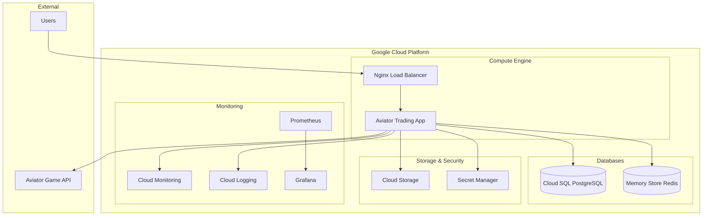

# 🚀 Factor Aviator - Google Cloud Platform Deployment

[](https://cloud.google.com/)
[](https://www.docker.com/)
[](https://www.terraform.io/)
[](https://docs.microsoft.com/en-us/powershell/)

## 📋 Descripción

**Factor Aviator** es un sistema de trading automatizado optimizado para el juego Aviator, diseñado para desplegarse de manera eficiente y escalable en Google Cloud Platform (GCP). Este repositorio contiene toda la infraestructura como código, scripts de automatización y configuraciones necesarias para un despliegue completo en la nube.

## 🎯 Características Principales

### 🎮 Trading Inteligente
- **Análisis de Patrones**: Algoritmos avanzados para detectar tendencias en el juego Aviator
- **Gestión de Riesgo**: Sistema robusto de stop-loss y take-profit
- **Trading Automatizado**: Ejecución automática basada en señales de mercado
- **Backtesting**: Validación de estrategias con datos históricos

### ☁️ Infraestructura GCP
- **Compute Engine**: Instancias optimizadas para alta disponibilidad
- **Cloud SQL**: Base de datos PostgreSQL gestionada
- **Cloud Storage**: Almacenamiento seguro para logs y backups
- **Cloud Monitoring**: Monitoreo y alertas en tiempo real
- **Secret Manager**: Gestión segura de credenciales

### 🔧 DevOps y Automatización
- **Infrastructure as Code**: Terraform para gestión de infraestructura
- **Containerización**: Docker para portabilidad y escalabilidad
- **CI/CD**: Pipelines automatizados con Cloud Build
- **Monitoreo**: Prometheus, Grafana y alertas personalizadas

## 🏗️ Arquitectura del Sistema



## 📁 Estructura del Proyecto

```
FactorAviator-GCP/
├── 📄 README.md                    # Este archivo
├── 🔧 .env.gcp                     # Variables de entorno GCP
├── 🐳 docker-compose.gcp.yml       # Configuración Docker para GCP
├── ⚙️ gcp-config.json             # Configuración completa de GCP
├── 📁 scripts/                     # Scripts de automatización
│   ├── 🔧 setup-gcp-steps.ps1     # Configuración inicial de GCP
│   ├── 🚀 deploy.ps1               # Script de despliegue
│   └── 🔍 verify-gcp-setup.ps1     # Verificación de configuración
├── 📁 terraform/                   # Infraestructura como código
│   ├── 🏗️ main.tf                 # Configuración principal
│   ├── 🔧 variables.tf             # Variables de Terraform
│   ├── 📤 outputs.tf               # Outputs de Terraform
│   └── 🔐 terraform.tfvars.example # Ejemplo de variables
├── 📁 monitoring/                  # Configuración de monitoreo
│   ├── 📊 prometheus.yml           # Configuración Prometheus
│   ├── 📈 grafana-dashboards/      # Dashboards de Grafana
│   └── 🚨 alerting-rules.yml       # Reglas de alertas
└── 📁 docs/                        # Documentación adicional
    ├── 📖 deployment-guide.md       # Guía de despliegue
    ├── 🔧 troubleshooting.md        # Solución de problemas
    └── 📊 monitoring-guide.md       # Guía de monitoreo
```

## 🚀 Inicio Rápido

### 📋 Prerrequisitos

1. **Google Cloud CLI** instalado y configurado
   ```powershell
   # Instalar con Chocolatey
   choco install gcloudsdk
   
   # Autenticar
   gcloud auth login
   gcloud auth application-default login
   ```

2. **PowerShell 5.0+** (Windows)
   ```powershell
   $PSVersionTable.PSVersion
   ```

3. **Docker** instalado
   ```powershell
   docker --version
   ```

4. **Terraform** (opcional, para infraestructura personalizada)
   ```powershell
   choco install terraform
   ```

### 🔧 Configuración Inicial

1. **Clonar el repositorio**
   ```bash
   git clone https://github.com/darkroker/FactorAviator-GCP.git
   cd FactorAviator-GCP
   ```

2. **Configurar variables de entorno**
   ```powershell
   # Copiar y editar el archivo de configuración
   cp .env.gcp .env.local
   # Editar .env.local con tus valores específicos
   ```

3. **Configurar proyecto GCP**
   ```powershell
   # Ejecutar script de configuración automática
   .\scripts\setup-gcp-steps.ps1 -ProjectId "tu-proyecto-gcp" -Region "us-central1"
   ```

4. **Verificar configuración**
   ```powershell
   # Verificar que todo esté configurado correctamente
   .\scripts\verify-gcp-setup.ps1 -ProjectId "tu-proyecto-gcp" -DetailLevel "full"
   ```

### 🚀 Despliegue

```powershell
# Despliegue completo en GCP
.\scripts\deploy.ps1 -ProjectId "tu-proyecto-gcp" -Environment "production"

# Despliegue solo de la aplicación (sin infraestructura)
.\scripts\deploy.ps1 -ProjectId "tu-proyecto-gcp" -SkipTerraform

# Despliegue en modo desarrollo
.\scripts\deploy.ps1 -ProjectId "tu-proyecto-gcp" -Environment "development"
```

## 🔧 Configuración Detallada

### 🌐 Variables de Entorno Principales

| Variable | Descripción | Ejemplo |
|----------|-------------|----------|
| `GCP_PROJECT_ID` | ID del proyecto GCP | `aviator-trading-system` |
| `GCP_REGION` | Región de GCP | `us-central1` |
| `GCP_ZONE` | Zona de GCP | `us-central1-a` |
| `DB_PASSWORD` | Contraseña de la base de datos | `SecurePassword123!` |
| `REDIS_PASSWORD` | Contraseña de Redis | `RedisSecurePassword123!` |

### 🔐 Gestión de Secretos

Todos los secretos se gestionan a través de **Google Secret Manager**:

```powershell
# Crear secretos
gcloud secrets create db-password --data-file="password.txt"
gcloud secrets create redis-password --data-file="redis-password.txt"
gcloud secrets create api-keys --data-file="api-keys.json"
```

### 🏗️ Infraestructura como Código

La infraestructura se define en Terraform:

```hcl
# Ejemplo de configuración en main.tf
resource "google_compute_instance" "aviator_app" {
  name         = "aviator-app-instance"
  machine_type = "e2-standard-4"
  zone         = var.zone
  
  boot_disk {
    initialize_params {
      image = "ubuntu-os-cloud/ubuntu-2004-lts"
      size  = 50
      type  = "pd-ssd"
    }
  }
  
  # Configuración adicional...
}
```

## 📊 Monitoreo y Observabilidad

### 📈 Métricas Principales

- **Performance de Trading**: Latencia, throughput, éxito de operaciones
- **Infraestructura**: CPU, memoria, disco, red
- **Aplicación**: Errores, logs, health checks
- **Base de Datos**: Conexiones, queries, performance

### 🚨 Alertas Configuradas

- CPU > 80% por 5 minutos
- Memoria > 85% por 5 minutos
- Disco > 90%
- Errores de aplicación > 10/minuto
- Pérdidas de trading > umbral configurado

### 📊 Dashboards Disponibles

1. **Overview del Sistema**: Métricas generales y health status
2. **Trading Performance**: Análisis de operaciones y rentabilidad
3. **Infrastructure Monitoring**: Estado de la infraestructura GCP
4. **Application Logs**: Logs centralizados y análisis de errores

## 🔒 Seguridad

### 🛡️ Medidas Implementadas

- **IAM**: Roles y permisos mínimos necesarios
- **Network Security**: VPC, subnets, firewall rules
- **Encryption**: Datos en tránsito y en reposo
- **Secret Management**: Google Secret Manager
- **SSL/TLS**: Certificados automáticos
- **Rate Limiting**: Protección contra ataques

### 🔐 Service Account

El sistema utiliza una Service Account con los siguientes roles:

- `roles/compute.admin`
- `roles/cloudsql.admin`
- `roles/storage.admin`
- `roles/monitoring.editor`
- `roles/secretmanager.secretAccessor`

## 🚨 Solución de Problemas

### ❌ Problemas Comunes

1. **Error de autenticación**
   ```powershell
   gcloud auth login
   gcloud auth application-default login
   ```

2. **APIs no habilitadas**
   ```powershell
   .\scripts\setup-gcp-steps.ps1 -ProjectId "tu-proyecto" -EnableAPIs
   ```

3. **Problemas de permisos**
   ```powershell
   # Verificar roles de la Service Account
   gcloud projects get-iam-policy tu-proyecto-id
   ```

4. **Fallos en el despliegue**
   ```powershell
   # Verificar logs
   gcloud logging read "resource.type=gce_instance" --limit=50
   ```

### 🔍 Logs y Debugging

```powershell
# Ver logs de la aplicación
gcloud logging read "resource.type=gce_instance AND resource.labels.instance_name=aviator-app-instance"

# Ver métricas de performance
gcloud monitoring metrics list --filter="metric.type:compute.googleapis.com"

# Conectar a la instancia para debugging
gcloud compute ssh aviator-app-instance --zone=us-central1-a
```

## 📈 Escalabilidad

### 🔄 Auto Scaling

El sistema incluye configuración para auto-escalado:

- **Horizontal**: Múltiples instancias basadas en carga
- **Vertical**: Ajuste automático de recursos
- **Database**: Read replicas para Cloud SQL
- **Storage**: Escalado automático de Cloud Storage

### 🌍 Multi-Region

Para alta disponibilidad:

```powershell
# Desplegar en múltiples regiones
.\scripts\deploy.ps1 -ProjectId "tu-proyecto" -Region "us-central1,europe-west1"
```

## 💰 Optimización de Costos

### 💡 Recomendaciones

1. **Preemptible Instances**: Para cargas no críticas
2. **Committed Use Discounts**: Para uso predecible
3. **Storage Classes**: Lifecycle policies para datos antiguos
4. **Monitoring**: Alertas de presupuesto configuradas

### 📊 Estimación de Costos

| Componente | Costo Mensual (USD) | Descripción |
|------------|--------------------|--------------|
| Compute Engine | $50-150 | Instancia e2-standard-4 |
| Cloud SQL | $30-80 | PostgreSQL db-f1-micro |
| Cloud Storage | $5-20 | Almacenamiento y transferencia |
| Monitoring | $10-30 | Logs y métricas |
| **Total** | **$95-280** | Dependiendo del uso |

## 🤝 Contribución

### 📝 Cómo Contribuir

1. Fork el repositorio
2. Crear una rama para tu feature (`git checkout -b feature/nueva-funcionalidad`)
3. Commit tus cambios (`git commit -am 'Agregar nueva funcionalidad'`)
4. Push a la rama (`git push origin feature/nueva-funcionalidad`)
5. Crear un Pull Request

### 🐛 Reportar Bugs

Usa las [GitHub Issues](https://github.com/darkroker/FactorAviator-GCP/issues) para reportar bugs o solicitar nuevas funcionalidades.

## 📄 Licencia

Este proyecto está bajo la Licencia MIT. Ver el archivo [LICENSE](LICENSE) para más detalles.

## 📞 Soporte

- **Email**: support@aviator-trading.com
- **Discord**: [Servidor de Discord](https://discord.gg/aviator-trading)
- **Documentación**: [Wiki del Proyecto](https://github.com/darkroker/FactorAviator-GCP/wiki)

## 🙏 Agradecimientos

- **Google Cloud Platform** por la infraestructura robusta
- **Spribe** por el juego Aviator
- **Comunidad Open Source** por las herramientas utilizadas

---

<div align="center">

**🚀 ¡Despliega tu sistema de trading Aviator en GCP hoy mismo! 🚀**

[](https://console.cloud.google.com/cloudshell/open?git_repo=https://github.com/darkroker/FactorAviator-GCP)

</div>

---

*Última actualización: Agosto 2025 | Versión: 1.0.0*